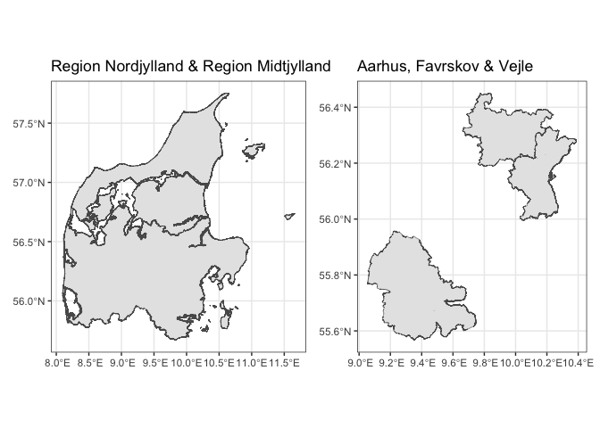

<!-- README.md is generated from README.Rmd. Please edit that file -->

# geodk

<!-- badges: start -->

[](https://github.com/aleksanderbl29/geodk/actions/workflows/R-CMD-check.yaml)
[](https://app.codecov.io/gh/aleksanderbl29/geodk)
[](https://www.repostatus.org/#wip)
<!-- badges: end -->

`{geodk}` provides access to Danish geospatial data.

## Installation

You can install the development version of geodk from
[GitHub](https://github.com/) with:

``` r
# install.packages("pak")
pak::pak("aleksanderbl29/geodk")
```

## Installation

You can install `{geodk}` from r-universe with:

``` r
install.packages(
  "geodk",
  repos = c(
    aleksanderbl29 = "https://aleksanderbl29.r-universe.dev",
    getOption("repos")
  )
)
```

You can install the latest development version of `{geodk}` from
[GitHub](https://github.com/aleksanderbl29/geodk) with:

``` r
# install.packages("devtools")
devtools::install_github("aleksanderbl29/geodk")
```

## Functions

`{geodk}` provides to main sets of functions:

- Data retrieval
- Plotting

### Plotting

The plotting functions include `plot_denmark()` which easily plots a
basic map of Denmark and returns it as a `{ggplot2}` object for you to
edit. It also includes `plot_region()` and `plot_municipality()` which
plots a subset of Denmark with focus on provided regions or
municipalities.

``` r
library(geodk)
plot_denmark()
#> → Getting data on `regioner`. This usually takes 10.24s.
#> Fetching data from the API. This will take some time.
#> Reading data to `st`.
#> Converting map data to `sf` object
```


``` r
region <- plot_regions(region = c("Region Nordjylland", "Region Midtjylland"))
#> → Using cached response.
#> Change this behaviour by setting cache = FALSE
```

``` r
municipality <- plot_municipalities(municipality = c("Aarhus", "Favrskov", "Vejle"))
#> → Getting data on `kommuner`. This usually takes 13.13s.
#> Fetching data from the API. This will take some time.
#> Reading data to `st`.
#> Converting map data to `sf` object
```

``` r
library(patchwork)
region + municipality
```


